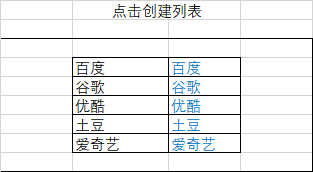

# 节点
- 根元素：html标签   
- 节点node：页面中所有的内容（标签、属性、文本）
  - 节点的属性：可以使用标签/元素'.'出来，可以使用属性节点'.'出来，可以使用文本节点'.'出来
  - 文本包括：文字、换行、空格、回车
#### 节点的重要内容：
1.  nodeType:节点的类型（数字与类型一一对应）：   
    1. 标签
    2. 属性
    3. 文本
2. nodeName:节点名字   
    1. 标签节点：大写的标签名字
    2. 属性节点：小写的属性名字
    3. 文本节点：#text
3. nodeValue:节点的值
    1. 标签节点：null
    2. 属性节点：属性值
    3. 文本节点：文本内容   

- 父节点：.parentNode   
- 父级元素：.parentElement (父节点和父级元素的结果一样) 
- 子节点：.childNodes (包含所有标签和文本)   
- 子元素：.children (只包含所有标签) 

#### 以下谷歌和火狐都支持，IE8只支持节点，不支持元素，且节点变成元素：

- 第一个子节点：.firstChild   
- 第一个子元素：.firstElementChild   
- 最后一个子节点：.lastChild   
- 最后一个子元素：.lastElementChild   
- 某个元素的前一个兄弟节点：.previousSibling   
- 某个元素的前一个兄弟元素：.previousElementSibling   
- 某个元素的后一个兄弟节点：.nextSibling   
- 某个元素的后一个兄弟元素：.nextElementSibling

#### 总结：
1. 凡是获取节点的代码，在谷歌和火狐得到的都是相关的节点
2. 凡是获取元素的代码，在谷歌和火狐得到的都是相关的元素
3. 从子节点和兄弟节点开始，凡是获取节点的代码在IE8中得到的都是元素；获取元素的代码，在IE8中得到的都是undefined。即：元素的代码，IE中不支持。 
-------
# 元素创建的不同方式
1. document.write("标签的代码及内容");
    - document write() 这种方式有缺陷，如果在页面加载完毕时，使用此方法创建元素，页面所有的东西都会被覆盖；
2. 对象.innerHTML="标签及代码"；
    - 对象.innerHTML的方式，点一次就加载一次，若把内容放在body里，则body里的其他内容会被覆盖，一般是放到其他父级元素里；
~~~js
//动态创建列表
var names=["小红","小明","小花","小杨"]
my$("btn").onclick=function(){
    var str="<url style='list-style-type: none; cursor: pointer'>";
    //根据循环列表创建对应对数的li
    for (var i=0; i<names.length; i++){
        str+="<li>"+names[i]+"</li>";
    }
    str+="</ul>";
    my$("dv").innerHTML=str;
}
~~~
3. document.createElement("标签的名字");   
~~~js
var pObj=document.createElement("p");//创建标签
pObj.innerHTML="这是一个p";//设置标签内容
my$("dv").appentChild(pObj);//把创建后的子元素追加到父级元素中
~~~
## 元素操作的相关方法
- appendChild(); *追加子元素*   
- insertBefore(newChild, refChild); *2个参数，把new插入到ref之前* 
- replaceChild(newChild, refChild); *2个参数，用new替换掉ref*   
- removeChild(); *移除元素*  
## 案例
1. 点击按钮删除所有子元素
~~~js
while (my$("dv").firstElementChild){
    my$("dv").removeChild(my$("dv").fisrtElementChild);
}
~~~
2. 只创建一个元素:有则删除/无则创建 

   1. 有则删除
~~~js
my$("btn").onclick=function(){
    if(my$("btn2")){
        my$("dv").removeChild(my("btn2"));
    }
    var obj=document.createElement("input");
    obj.type="button";
    obj.value="按钮";
    obj.id="btn2";
    my$("dv").appendChild(obj);
}
~~~
 2. 无则创建   
~~~js
my$("btn").onclick=function(){
    if(!my$("btn2")){
        var obj=document.createElement("input");
        obj.type="button";
        obj.value="按钮"；
        obj.id="btn2"；
        my$("dv").appendChild(obj);
    }
}
~~~

3. 动态创建列表
~~~js
//点击按钮，动态创建列表，把列表加到div中
my$("btn").onclick=function(){
    //创建ul，把ul立刻加入到父级元素div中
    var ulObj=document.createElement("ul");
    my$("dv").appendChild(ulObj);
    //动态创建li，加到ul中
    for (var i=0; i<arr.length; i++){
        var liObj=document.createElement("li");
        //设置li中间的文字内容
        liObj.innerHTML="arr[i]";
        ulObj.appendChild(liObj);
        //为li添加鼠标进入/离开事件
        liObj.onmouseover=function(){
            this.style.backgroundColor="red";
        };
        liObj.onmouseout=function(){
            this.style.backgroundColor="";
        };
    }
}
~~~
4. 动态创建表格   

~~~js
var arr=[
    {name:"百度", href:"http://www.baidu.com"},
    {name:"谷歌", href:"http://www.google.com"},
    {name:"优酷", href:"http://www.youku.com"},
    {name:"土豆", href:"http://www.tudou.com"},
    {name:"爱奇艺", href:"http://www.aiqiyi.com"}
];
my$("btn").onclick=function(){
    //创建table加入到div中
    var tableObj=document.createElement("table");
    tableObj.cellpadding="0";
    tableObj.cellspacing="0";
    table.border="1";
    my$("dv").appendChild(tableObj);
    //创建行，把行加到table中
    for (var i=0; i<arr.length; i++){
        var dt=arr[i];//每个对象
        var trObj=document.createElement("tr");
        tableObj.appendChild(trObj);
        //创建第一个列，然后加入到行中
        var td1=document.createElement("td");
        td1.innerText=dt.name;
        trObj.appendChild(td1);
        //创建第二个列
        var td2=document.createElement("td");
        td2.innerHTML="<a href="+dt.href+">"+dt.name+"</a>";
        trObj.appendChild(td2);            
        }
}
~~~

---
# 为元素添加/绑定多个事件
 为同一个元素绑定同一个事件，避免前面的事件被后面添加的事件所覆盖 
#### 对元素绑定事件（DOM）:一种方式，但是不兼容，所以有2种
1. 对象.addEventListener("事件类型", 事件处理函数, false)  
*谷歌火狐支持，IE11支持，IE8不支持；当中的this指当前事件的对象*
    - 参数1：事件的类型type---事件的名字，e.g. click,没有on   
    - 参数2：事件处理函数--（命名函数，匿名函数）   
    - 参数3：布尔类型，目前就写false
 ~~~html
<input type="button" value="按钮" id="btn">
~~~
~~~js
var btn=document.getElementById("btn");
btn.addEventListener("click", function(){
    console.log ("添加/绑定事件");
}, false);
 ~~~
 2. 对象.attachEvent("有on的事件类型", 事件处理函数)    
  *谷歌火狐、IE11不支持，IE8支持；当中的this指window*
~~~js
btn.attachEvent("onclick", function(){
    console.log("IE8绑定事件");
})
~~~
 ### 为任意元素绑定任意事件兼容代码:    
 ~~~js
function addEventListener(element, type, fn){
    //判断浏览器是否支持这个方法  
    if(element.addEventListener){
        element.addEventListener(type, fn, false);
    } else if (elment.attachEvent){
        element.attachEvent("on"+type, fn);
    } else{
         element["on"+type]=fn; //对象.onclick也可以写成对象["onclick"]
    }
}
//测试
addEventListener(my$("btn"), "click", function(){
    console.log("验证是否正确1");
addEventListener(my$("btn"), "click", function(){
    console.log("验证是否正确2");
addEventListener(my$("btn"), "click", function(){
    console.log("验证是否正确3");
});
 ~~~
 ### 为元素解绑事件   
 点击第二个按钮，把第一个按钮的点击事件解绑   
 *注意：用什么方式绑定事件，就用什么方式解绑*  
 - 方式1：   
 对象.on事件名字=事件处理函数--->绑定事件   
 对象.on事件名字=null；---->解绑
 ~~~js
my$("btn").onclick=function(){
    console.log("绑定事件");
}
my$("btn2").onclick=function(){
    my$("btn").onclick=null;
};
 ~~~
 - 方式2：      
 *使用此方法解绑事件，需要在绑定事件时，使用命名函数*
~~~js
//使用此方法解绑事件，需要在绑定事件时，使用命名函数
function f1(){
    console.log("第一个");
}
function f2(){
    console.log("第二个");
}
my$("btn").addEventListener("click",f1,false);
my$("btn").addEventListener("click",f2,false);
//点击第二个按钮，把第一个按钮的第一个点击事件解绑
my$("btn2").onclick=function(){
    my$("btn").removeEventListener("click",f1,false);
};
~~~
- 方式3：   
对象.attachEvent("on事件类型",命名函数);--->绑定事件   
对象.detachEvent("on事件类型",命名函数);--->解绑
~~~js
//使用此方法解绑事件，需要在绑定事件时，使用命名函数
function f1(){
    console.log("第一个");
}
function f2(){
    console.log("第二个");
}
my$("btn").attachEvent("onclick",f1);
my$("btn").attachEvent("onclick",f2);
//点击第二个按钮，把第一个按钮的第一个点击事件解绑
my$("btn2").onclick=function(){
    my$("btn").detachEvent("onclick",f1);
};
~~~
### 解绑事件兼容代码
 ~~~js
function removeEventListener(element, type, fn){
    //判断浏览器是否支持这个方法  
    if(element.removeEventListener){
        element.removeEventListener(type, fn, false);
    } else if (elment.detachEvent){
        element.detachEvent("on"+type, fn);
    } else{
         element["on"+type]=null; //对象.onclick也可以写成对象["onclick"]
    }
}
//测试
addEventListener(my$("btn"), "click", function(){
    console.log("验证是否正确1");
addEventListener(my$("btn"), "click", function(){
    console.log("验证是否正确2");
addEventListener(my$("btn"), "click", function(){
    console.log("验证是否正确3");
});
 ~~~
 # 事件冒泡   
 事件冒泡：多个事件嵌套，有层次关系，这些元素都注册了相同事件，如果里面元素的事件触发了，外面元素的事件自动触发，这种现象叫做事件冒泡。
 ~~~html
 

    

        

    

 

 ~~~
 ~~~js
my$("dv1").onclick=function(){
    console.log(this.id);
}
my$("dv2").onclick=function(){
    console.log(this.id);
}
my$("dv3").onclick=function(){
    console.log(this.id);
}
 ~~~
#### 阻止事件冒泡
- window.event.cancelBubble=true; IE特有，谷歌支持，火狐不支持
- e.stopPropagation();  谷歌和火狐支持，IE8不支持
 ~~~js
my$("dv1").onclick=function(){
    console.log(this.id);
}
my$("dv2").onclick=function(){
    console.log(this.id);
}
//事件处理参数对象：e,需要的时候填，不需要的时候不填
my$("dv3").onclick=function(e){
    console.log(this.id);
    condole.log(e);
    //IE特有，谷歌支持，火狐不支持
    window.event.cancelBubble=true;
    //谷歌和火狐支持，IE8不支持e
    e.stopPropagation();
}
 ~~~
 # 总结事件
 事件有3个阶段：该属性在事件参数对象中存在
 1. 事件捕获阶段：从外向内
 2. 事件目标阶段：最开始选则的那个
 3. 事件冒泡阶段： 从里向外   

 为元素绑定事件
 - addEventListener("没有on的事件类型", 事件处理函数, 控制事件阶段的true/false)。事件触发的过程中，可能会出现事件冒泡的效果，为了阻止事件冒泡：
 - window.event.cancelBubble=true;--->谷歌和IE8支持
 - e.stopPropagation();--->火狐支持   
 - window.event和e都是事件参数对象，一个是IE标准，一个是火狐的标准
 - 事件参数e在IE8的浏览器不存在，此时用window.event来代替；
 - addEventListener的第三个参数是控制事件阶段的，事件阶段有三个：
 - 通过e.eventPhase这个属性可以知道当前事件是什么阶段   
    1--->捕获阶段   
    2--->目标阶段   
    3--->冒泡阶段   
    一般都是默认冒泡阶段，很少用捕获阶段
 ~~~js
//同时注册点击事件
var objs=[my$("dv3"), my$("dv2"), my$("dv1")];
//遍历注册事件
objs.forEach(function(ele){
//为每个元素绑定事件
ele.addEventListener("click",function(){
    console.log(this.id+"=====>"+e.eventPhase);
},false)
});
 ~~~
